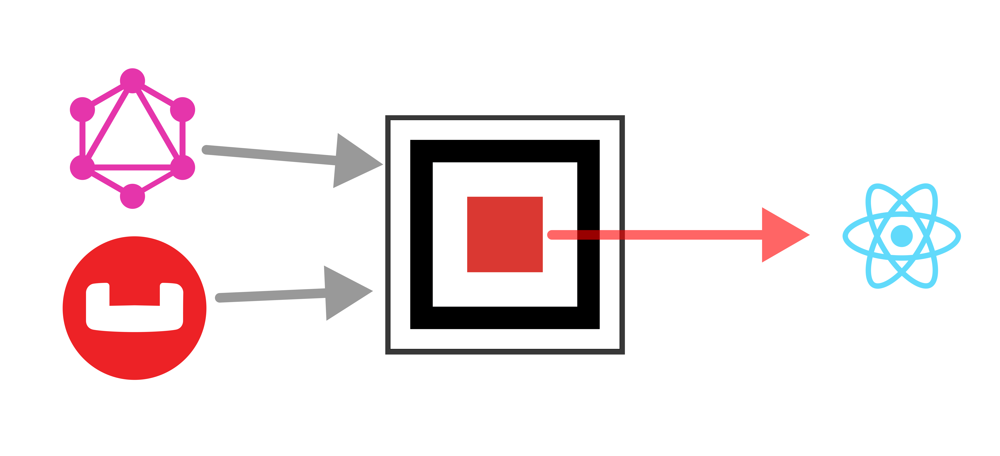
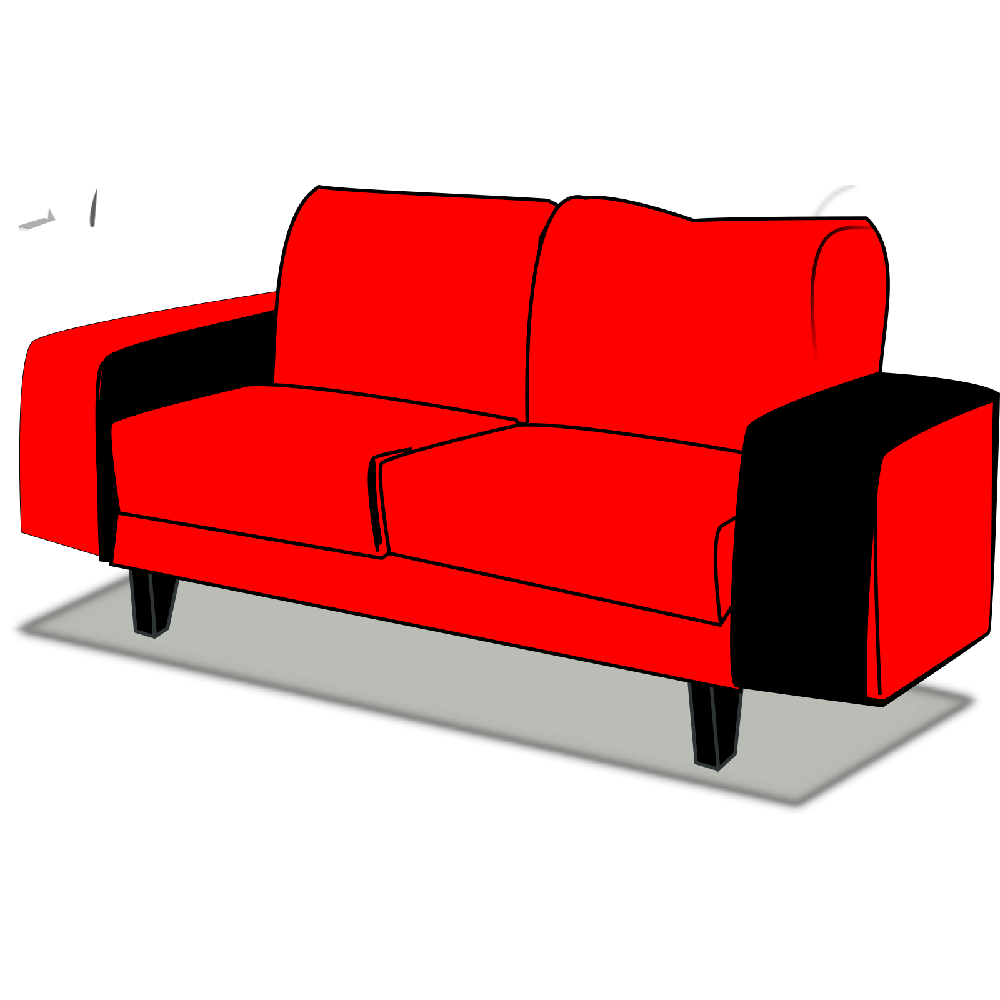

<p align="center">
  <h1 align="center"> CouchSet - Couchbase ORM & Automatic GraphQL API generator (Resolver/Queries)</h1>
</p>


<div align="center">

<div style="display: flex;justify-content:center;">


</img>

 

</div>

</img>
</div>


CouchSet is a Couchbase ORM & Automatic GraphQL API code generator (Resolver/Queries) tool


## 1. Install
```bash
npm i couchset --save
```

## 2. Start couchset
```ts
import { couchset } from 'couchset';

 const started = await couchset({
    connectionString: 'couchbase://localhost',
    username: 'admin',
    password: '123456',
    bucketName: 'stq'
 })
```

## 3. Create a Model and start using it

```ts
import { Model } from 'couchset';

const userModel = new Model('User');


// Create document
const created = await userModel.create({
    username: 'ceddy',
    password: 'love couchbase',
});

// Find document
const foundData = await userModel.findById(created.id);

// update document
const updatedData = await userModel.updateById(created.id, { ...created, someValue: 'x' });

// delete
const deletedData = await userModel.delete(created.id);

```

## 4. Pagination

All models come with a method for automatic pagination 
```ts
const paginationData = await userModel.pagination({
    select: ["id", "email", "phone","fullname"],
    where: { 
        userId: { $eq: "ceddy" },
        $or: [{ userId: { $eq: "ceddy" } }, { phone: 10 }],
        },
    limit: 100,
    page: 0,
});
```

which translates to this query 

```sql
SELECT * FROM `stq` WHERE _type="User" AND userId="ceddy" AND (userId="ceddy" OR phone=10) ORDER BY createdAt DESC LIMIT 100 OFFSET 0
```


Pagination results

```js
[
  {
    id: '209d3143-09b7-4b3d-bf7d-f0ccd3f98922',
    updatedAt: 2021-01-26T01:51:43.218Z,
    createdAt: 2021-01-26T01:51:43.210Z,
    _type: 'User',
    userId: 'ceddy',
    password: '...',
    someValue: 'x'
  },
  {
    id: '1392e4f6-ae1e-4e01-b7d5-103bdd0e843f',
    updatedAt: 2021-01-26T01:51:29.591Z,
    createdAt: 2021-01-26T01:51:29.583Z,
    _type: 'User',
    userId: 'ceddy',
    password: '...',
    someValue: 'x'
  }
]
```


## 5. Custom queries & Query builder
Query builder is inspired from node-ottoman, for more examples, please see https://ottomanjs.com/guides/query-builder.html#query-builder

```ts
import { Query } from 'couchset';

const params = {
  select: [
    {
      $count: {
        $field: {
          name: 'type',
        },
        as: 'odm',
      },
    },
  ],
  let: [
    { key: 'amount_val', value: 10 },
    { key: 'size_val', value: 20 },
  ],
  where: {
    $or: [{ price: { $gt: 'amount_val', $isNotNull: true } }, { auto: { $gt: 10 } }, { amount: 10 }],
    $and: [
      { price2: { $gt: 1.99, $isNotNull: true } },
      { $or: [{ price3: { $gt: 1.99, $isNotNull: true } }, { id: '20' }] },
    ],
    $any: {
      $expr: [{ $in: { search_expr: 'search', target_expr: 'address' } }],
      $satisfied: { address: '10' },
    },
    $in: { search_expr: 'search', target_expr: ['address'] },
  },
  groupBy: [{ expr: 'type', as: 'sch' }],
  letting: [
    { key: 'amount_v2', value: 10 },
    { key: 'size_v2', value: 20 },
  ],
  having: { type: { $like: '%hotel%' } },
  orderBy: { type: 'DESC' },
  limit: 10,
  offset: 1,
  use: ['airlineR_8093', 'airlineR_8094'],
};

const query = new Query(params, 'travel-sample').build();
console.log(query);

```

which translates to

```sql
SELECT COUNT(type) AS odm FROM travel-sample USE KEYS ["airlineR_8093","airlineR_8094"] LET amount_val=10,size_val=20 WHERE ((price>amount_val AND price IS NOT NULL) OR auto>10 OR amount=10) AND ((price2>1.99 AND price2 IS NOT NULL) AND ((price3>1.99 AND price3 IS NOT NULL) OR id="20")) AND ANY search IN address SATISFIES address="10" END AND search IN ["address"] GROUP BY type AS sch LETTING amount_v2=10,size_v2=20 HAVING type LIKE "%hotel%" ORDER BY type DESC LIMIT 10 OFFSET 1
```


### Running custom query on cluster

```ts
import { QueryCluster } from 'couchset';

const queryresults = await QueryCluster(queryBuilder);
// queryresults = { rows: object[], meta: any}

```

## 6. Model Automation

This is how we automate it to generate code with all methods,schema, queries 

```ts
const automaticUser = userModel.automate();
```

After automating the model, `automaticUser` will come with Server-side Resolver functions, and client queries, mutations, subscriptions, like below


```ts
// Get all automatic generated resolvers and queries/fragments,mutations,subscriptions
const {
  resolver: UserResolver, // Server resolver for building GraphQL 
  modelKeys: UserSelectors, // for any custom queries or exporting
  client, // client queries,mutations,subscriptions
} = automaticUser;

```

## 7. Write to filesystem
TODO


<br/>
<br/>
<br/>

#### Contributors needed 
- Create automatic pagination ✅
- Create Schema and validation/population ✅
- Create static methods for models like `save`, `update`, `findMany` e.t.c ✅
- Automated indexes
- Geospatial queries
- FTS queries


<div align="center">
</img>
</div>

<p align="center">
  <h1 align="center"> Algo Inc </h1>
</p>
