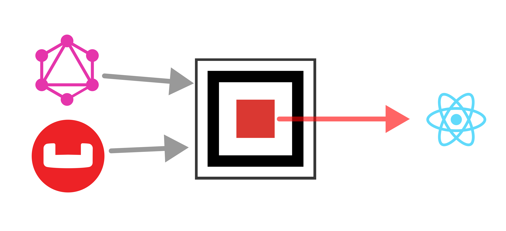

<p align="center">
  <h1 align="center">CouchSet</h1>
</p>

<div align="center">
  </img>
  <br />
  </img>
</div>

CouchSet is a Couchbase model layer for TypeScript and Node.js. The main `couchset` entrypoint is the modern API; the previous API is available from `couchset/legacy`.

- [Install](#install)
- [Quick Start](#quick-start)
- [Connection Lifecycle](#connection-lifecycle)
- [Models](#models)
- [Reads](#reads)
- [Writes](#writes)
- [Queries](#queries)
- [Legacy Import](#legacy-import)
- [Migration Notes](./docs/beta-migration.md)
- [License](#license)

## Install

```bash
npm i couchset --save
```

## Quick Start

```ts
import {couchset, Model} from 'couchset';

type User = {
    userId: string;
    email?: string;
};

const users = new Model('User', {
    schema: {
        createdAt: 'date',
        updatedAt: 'date',
    },
    indexes: [
        {
            name: 'idx_user_userId',
            fields: ['userId'],
        },
    ],
});

await couchset({
    connectionString: process.env.COUCHBASE_URL || 'couchbase://localhost',
    username: process.env.COUCHBASE_USERNAME || 'admin',
    password: process.env.COUCHBASE_PASSWORD || '1234',
    bucketName: process.env.COUCHBASE_BUCKET || 'dev',
});

await couchset.ready();

const created = await users.insert<User>({
    userId: 'ceddy',
    email: 'ceddy@example.com',
});

const found = await users.getById<User>(created.id);

const patched = await users.patchById<User>(created.id, {
    $set: {email: 'new@example.com'},
});

const page = await users.page<User>({
    where: {userId: {$eq: 'ceddy'}},
    limit: 25,
    page: 0,
});

await users.deleteById(created.id, {hard: true});
```

## Connection Lifecycle

Models can be declared before connecting. Model operations wait for the shared connection before binding to the Couchbase bucket and collection.

```ts
import {couchset, health, ping, ready, shutdown} from 'couchset';

await couchset({
    connectionString: 'couchbase://localhost',
    username: 'admin',
    password: '1234',
    bucketName: 'dev',
    autoReconnect: true,
    reconnectIntervalMs: 5000,
});

await ready();
await ping();
console.log(health());

await shutdown();
```

Reconnect is enabled by default. Environment flags:

- `COUCHSET_RECONNECT`: use `false`, `0`, or `no` to disable reconnect.
- `COUCHSET_RECONNECT_INTERVAL_MS`: reconnect and health-check interval in milliseconds. Default is `5000`.

## Models

```ts
const auditEvents = new Model('AuditEvent', {
    scope: 'app',
    collection: 'events',
    softDelete: true,
    defaultWhere: {tenantId: {$eq: 'tenant-1'}},
    dateFields: ['profile.createdAt'],
    validateCreate: (doc) => doc,
    validateReplace: (doc) => doc,
    parse: (doc) => doc,
});
```

Useful model helpers:

```ts
users.bucket(); // `dev`
users.keyspace(); // `dev` or default:`dev`.`scope`.`collection`
users.from('u'); // `dev` AS u
```

## Reads

```ts
await users.getById<User>('user::1');
await users.findByIdWithMeta<User>('user::1');

await users.findMany<User>({
    select: ['id', 'userId', 'email'],
    where: {userId: {$eq: 'ceddy'}},
    orderBy: {createdAt: 'DESC'},
    limit: 10,
});

await users.findOne<User>({where: {email: {$eq: 'ceddy@example.com'}}});
await users.exists({where: {userId: {$eq: 'ceddy'}}});
await users.count({where: {userId: {$eq: 'ceddy'}}});

const result = await users.page<User>({
    where: {userId: {$eq: 'ceddy'}},
    limit: 10,
    page: 0,
});

result.items;
result.hasNext;
result.pageInfo.nextPage;
```

Hydrated documents:

```ts
const doc = await users.findDocById<User & {id: string}>('user::1');

doc.email = 'updated@example.com';
await doc.save();
await doc.patch({$set: {verified: true}});
await doc.reload();
await doc.delete({hard: true});
```

Soft delete scopes:

```ts
await users.softDeleteById<User>('user::1');
await users.restoreById<User>('user::1');

await users.withDeleted().findMany<User>();
await users.onlyDeleted().findMany<User>();
await users.withoutDefaultWhere().findMany<User>();
```

## Writes

```ts
await users.insert<User>({id: 'user::1', userId: 'ceddy'});
await users.upsert<User>({id: 'user::1', userId: 'ceddy'});
await users.replaceById<User>('user::1', {userId: 'ceddy', email: 'new@example.com'});
await users.patchById<User>('user::1', {
    $set: {email: 'new@example.com'},
    $inc: {loginCount: 1},
    $unset: ['temporaryCode'],
});
await users.incrementById<User>('user::1', 'loginCount', 1);
await users.deleteById('user::1', {hard: true});
```

TTL helpers:

```ts
await users.insert<User>({id: 'user::1', userId: 'ceddy'}, {ttl: '2h'});
await users.upsert<User>({id: 'user::2', userId: 'ceddy'}, {ttlSeconds: 300});
```

## Queries

Modern query helpers pass SDK parameters correctly and throw on failures by default.

```ts
const rows = await users.queryRows<User>(
    `SELECT u.* FROM ${users.from('u')} WHERE u.userId=$userId LIMIT $limit`,
    {userId: 'ceddy', limit: 10}
);

const first = await users.queryOne<User>(
    `SELECT u.* FROM ${users.from('u')} WHERE u.email=$email LIMIT 1`,
    {email: 'ceddy@example.com'}
);

const page = await users.queryPage<User>(
    `SELECT u.* FROM ${users.from('u')} WHERE u.userId=$userId LIMIT $limit`,
    {userId: 'ceddy', limit: 10}
);
```

Model read helpers also throw by default. Use `throwOnError: false` only when an empty fallback is intentional.

```ts
const rows = await users.findMany<User>({
    where: {userId: {$eq: 'ceddy'}},
    throwOnError: false,
});
```

## Indexes

```ts
const users = new Model('User', {
    indexes: [
        {
            name: 'idx_user_email',
            fields: ['email'],
            where: {deleted: {$isNotValued: true}},
        },
    ],
});

await users.ensureIndexes();
await couchset.ensureIndexes();
```

## Includes

```ts
const posts = new Model('Post');

const rows = await posts.findMany({
    where: {published: {$eq: true}},
    include: [
        {
            as: 'author',
            model: users,
            key: 'authorId',
            type: 'leftJoin',
        },
    ],
});
```

## Time Series

```ts
import {TimeSeriesModel} from 'couchset';

const metrics = new TimeSeriesModel('Metric', {
    keyField: 'deviceId',
    timeField: 'timestamp',
    values: [{field: 'temperature'}],
    interval: '1m',
});

await metrics.appendChunk('device-1', [
    {deviceId: 'device-1', timestamp: Date.now(), temperature: 21.5},
]);
```

## Legacy Import

Use `couchset/legacy` for applications that still depend on the old model names such as `create`, `findById`, `updateById`, `delete`, `pagination`, or `customQuery`.

```ts
import {couchset, Model} from 'couchset/legacy';
```

Modern replacements:

| Old method | Modern method |
| --- | --- |
| `create()` | `insert()` or `upsert()` |
| `findById()` | `getById()` |
| `updateById()` / `save()` | `replaceById()` or `patchById()` |
| `delete()` | `deleteById()` |
| `pagination()` | `findMany()` or `page()` |
| `customQuery()` | `queryRows()`, `queryOne()`, or `queryPage()` |

## Local Tests

```bash
npm run build
npm test
npm run test:serverless
```

Set `COUCHBASE_URL`, `COUCHBASE_BUCKET`, `COUCHBASE_USERNAME`, and `COUCHBASE_PASSWORD` to point the integration tests at a local Couchbase instance.

## License

CouchSet is [MIT licensed](./LICENSE).
